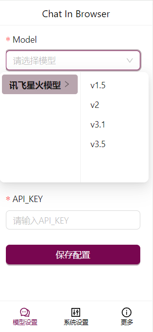
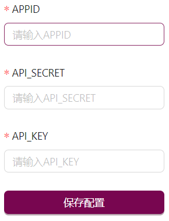
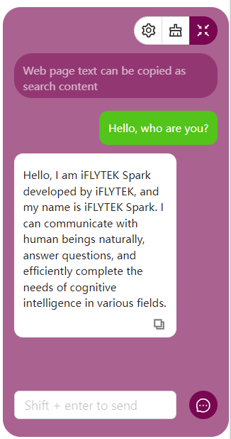
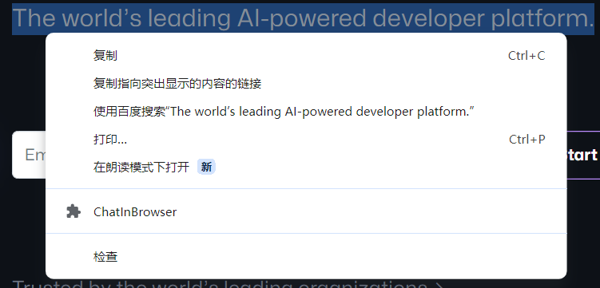
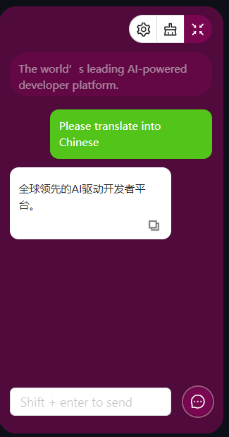
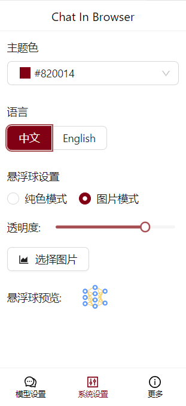

# ChatInBrowser
### <u>[Chinese Document](README.md)</u>
### <u>[Download from the Microsoft Edge Store](https://microsoftedge.microsoft.com/addons/detail/chatinbrowser/dnniphioahcepggnakblboabmpllegci)</u>

ChatInBrowser allows you to chat anytime in your browser using a large model, and it even supports directly copying web content as part of the Prompt for querying.

Currently supported models are:

#### [OpenAI](https://platform.openai.com/docs/introduction)
[gpt-3.5-turbo](https://platform.openai.com/docs/guides/text-generation/chat-completions-api)
#### [Spark Model](https://xinghuo.xfyun.cn/sparkapi)
[Spark v1.5](https://www.xfyun.cn/doc/spark/Web.html), [Spark v2.0](https://www.xfyun.cn/doc/spark/Web.html), [Spark v3.1](https://www.xfyun.cn/doc/spark/Web.html), [Spark v3.5](https://www.xfyun.cn/doc/spark/Web.html)
#### [Ernie Bot](https://console.bce.baidu.com/qianfan/overview)
[Ernie-3.5](https://cloud.baidu.com/doc/WENXINWORKSHOP/s/jlil56u11), [Ernie-4.0](https://cloud.baidu.com/doc/WENXINWORKSHOP/s/clntwmv7t)
#### [AliYun DashScope](https://help.aliyun.com/zh/dashscope/developer-reference/tongyiqianwen-large-language-models)
[qwen-turbo](https://help.aliyun.com/zh/dashscope/developer-reference/model-introduction), [qwen-plus](https://help.aliyun.com/zh/dashscope/developer-reference/model-introduction), [qwen-max](https://help.aliyun.com/zh/dashscope/developer-reference/model-introduction)
#### [DeepSeek](https://api-docs.deepseek.com/zh-cn/)
[deepseek-chat(deepseek-v3)](https://api-docs.deepseek.com/zh-cn/quick_start/pricing)

[deepseek-reasoner(deepseek-r1)](https://api-docs.deepseek.com/zh-cn/quick_start/pricing)

## Update Log
2025-03-03 (v1.0.5)
1. Supports deepseek-v3 and deepseek-r1 models.

2024-04-22 (v1.0.4)
1. Supports Qwen-Turbo, Qwen-Plus, and Qwen-Max models.

2024-04-18 (v1.0.3)
1. Support Ernie Bot 3.5 and 4.0 models

2024-04-16 (v1.0.2):
1. Chat box now supports displaying the model version number to assist users in differentiation.
2. Floating tooltips have been added to the top buttons within the chat box.

2024-4-12 (v1.0.1):
1. Added mask function, supporting the use of different prompts to fine-tune LLM.
2. Added new user guide function to help users quickly get started with the plugin.
3. Fixed some bugs.

2024-4-8: 
1. Popup defaults to displaying the last opened route page
2. Fixed some bugs.

2024-4-7: 
1. Added support for DIY floating ball appearance.
2. Fixed some bugs.

## Development Steps
### 1. Navigate to the Project Root Directory
```bash
cd your_path/ChatInBrowser
```
### 2. Install Dependencies
```bash
yarn install
```
### 3. Build the Project
```bash
yarn build
```
### 4. Debug Popup Page
Due to some interfaces not supporting browser environment, this debugging method is only applicable to UI interface debugging. It is recommended to package the project and then go to [chrome://extensions/](chrome://extensions/) for functionality and interface-level debugging.
```bash
yarn dev
```
Open the debug link in the browser [http://localhost:5173/](http://localhost:5173/)

## Installation Process
### 1. Clone the Github Repository
```bash
git clone https://github.com/callmexhj/ChatInBrowser.git
```
### 2. Install Chrome Extension
- Open Chrome browser.
- Enter chrome://extensions/ in the address bar and press Enter.
- Enable Developer mode in the top right corner.
- Click on the "Load unpacked" button.
- Select the build folder in the project.
- Click "Open".
### 3. Check if the plugin is installed successfully
- Ensure that the plugin icon appears in the Chrome browser toolbar or extension page.
- It is recommended to click the pin button  to pin the plugin to the toolbar for daily settings and usage.

## Model Configuration
Currently, only the models of iFLYTek Starfire v1.5, v2.0, v3.1, and v3.5 are supported, and more models will be added in the future.

### Configuration of iFLYTek Starfire Model
#### 1. Register an iFLYTek Starfire Model account and apply for API access permission.
#### 2. Apply for access to the corresponding version of the model (new users can get free tokens).
#### 3. In the Popup interface in the upper right corner of the browser, select the model version in the model settings.

#### 4. Fill in the provided APPID, APISecret, and APIKey in the console, then click Save Configuration.


## Model Usage Example
After completing the model configuration, you can use the model.

### 1. Chat Directly


### 2. Ask Questions After Selecting Web Page Text
- After selecting text, right-click and select ChatInBrowser.

    

- In the automatically opened chat box, ask your question.

    

### 3. Other Functions
- One-click Clear Dialogue

    

- System Settings

    

- One-click Copy

    

- Support for changing theme colors, internationalization, and other capabilities.

- Explore other features, continuously iterating.

## Let's Optimize This Project Together
Welcome everyone to raise issues or submit code to improve this project!