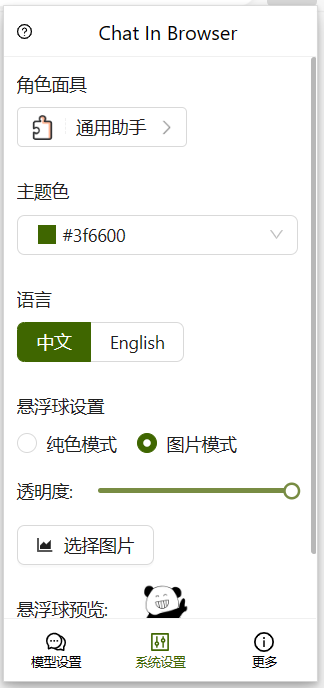

# ChatInBrowser
### <u>[English Document](README.en.md)</u>
### <u>[从微软Edge商店下载](https://microsoftedge.microsoft.com/addons/detail/chatinbrowser/dnniphioahcepggnakblboabmpllegci)</u>
ChatInBrowser可以让你在浏览器随时使用大模型进行聊天，更支持直接复制网页内容作为Prompt的一部分进行提问。

目前支持的模型有：
#### [OpenAI](https://platform.openai.com/docs/introduction)
[gpt-3.5-turbo](https://platform.openai.com/docs/guides/text-generation/chat-completions-api)
#### [科大讯飞星火大模型](https://xinghuo.xfyun.cn/sparkapi)
[Spark v1.5](https://www.xfyun.cn/doc/spark/Web.html), [Spark v2.0](https://www.xfyun.cn/doc/spark/Web.html), [Spark v3.1](https://www.xfyun.cn/doc/spark/Web.html), [Spark v3.5](https://www.xfyun.cn/doc/spark/Web.html)
#### [百度文心一言大模型](https://console.bce.baidu.com/qianfan/overview)
[Ernie-3.5](https://cloud.baidu.com/doc/WENXINWORKSHOP/s/jlil56u11), [Ernie-4.0](https://cloud.baidu.com/doc/WENXINWORKSHOP/s/clntwmv7t)
#### [阿里通义千问大模型](https://help.aliyun.com/zh/dashscope/developer-reference/tongyiqianwen-large-language-models)
[qwen-turbo](https://help.aliyun.com/zh/dashscope/developer-reference/model-introduction), [qwen-plus](https://help.aliyun.com/zh/dashscope/developer-reference/model-introduction), [qwen-max](https://help.aliyun.com/zh/dashscope/developer-reference/model-introduction)

## 更新记录
2024-04-22 (v1.0.4)
1. 支持通义千问qwen-turbo, qwen-plus, qwen-max模型

2024-04-18 (v1.0.3)
1. 支持文心一言3.5和4.0模型

2024-04-16 (v1.0.2)
1. 聊天框中支持显示模型版本号，以帮助用户区分。
2. 聊天框顶部按钮新增悬浮提示。

2024-4-12 (v1.0.1)
1. 新增了面具功能，支持使用不同的Prompt来微调LLM。
2. 新增了新手指引功能，帮助用户快速入门插件。
3. 修复了部分bug。

2024-4-8 
1. Popup默认显示上次打开的路由页面。
2. 修复了部分bug。

2024-4-7 
1. 支持DIY悬浮球外观。
2. 修复了部分bug。

## 开发步骤
### 1. 移动至项目根目录
```bash
cd your_path/ChatInBrowser
```
### 2. 安装依赖
```bash
yarn install
```
### 3. 打包项目
```bash
yarn build
```
### 4. 调试Popup页面
由于部分接口不支持在浏览器环境运行，故该调试方法仅适用于UI界面的调试。功能和接口层面的调试建议打包项目后前往[chrome://extensions/](chrome://extensions/)进行。
```bash
yarn dev
```
浏览器打开调试链接[http://localhost:5173/](http://localhost:5173/)
## 安装流程
### 1. 克隆Github仓库
```bash
git clone https://github.com/callmexhj/ChatInBrowser.git
```
### 2. 安装Chrome插件
- 打开Chrome浏览器。
- 在地址栏中输入 chrome://extensions/ 并按下回车键。
- 在右上角开发者模式下勾选。
- 点击“加载已解压的扩展程序”按钮。
- 选择项目中的build文件夹。
- 点击“打开”按钮。
### 3. 检查插件是否安装成功
- 确保插件图标出现在Chrome浏览器的工具栏或扩展程序页面中。
- 建议点击固定按钮  将插件固定在工具栏以方便日常设置和使用。
## 模型配置
目前仅支持科大讯飞星火模型v1.5, v2.0, v3.1和v3.5等四个模型，后期将新增更多模型的支持。
### 科大讯飞星火模型配置
#### 1. 注册科大讯飞星火模型账号，并申请API接入权限
#### 2. 申请开通对应版本的模型权限（新用户可获得免费Token）
#### 3. 在浏览器右上角Popup界面-模型设置中，选择模型版本

#### 4. 分别填入控制台提供的APPID，APISecret和APIKey后点击保存配置

## 模型使用示例
在完成模型配置后，可以进行模型使用。
### 1. 直接聊天

### 2. 选取网页文本后提问
- 选取文本后，点击鼠标右键-ChatInBrowser

    

- 在自动打开的聊天框中，提出问题

    

### 3. 其他功能
- 一键清空对话

    

- 系统设置

    

- 一键复制

    

- 支持主题色改变，国际化等能力

- 其他功能等你探索，正在不断迭代中

## 一起优化这个项目
欢迎大家提出ISSUE或者提交代码来改进这个项目！